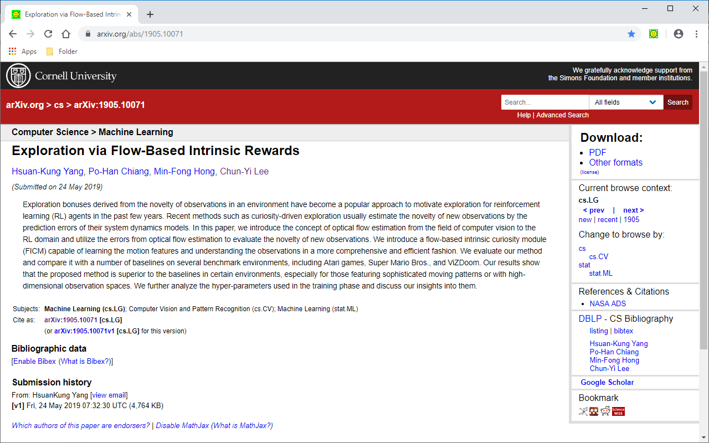
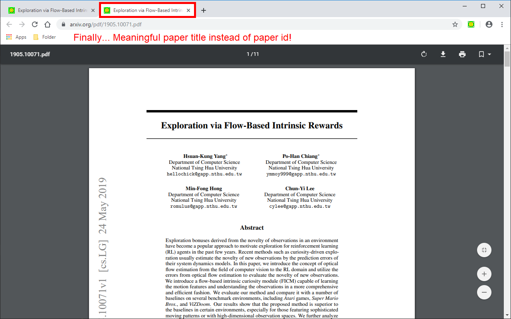
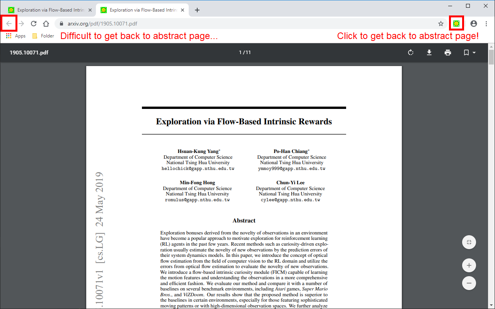
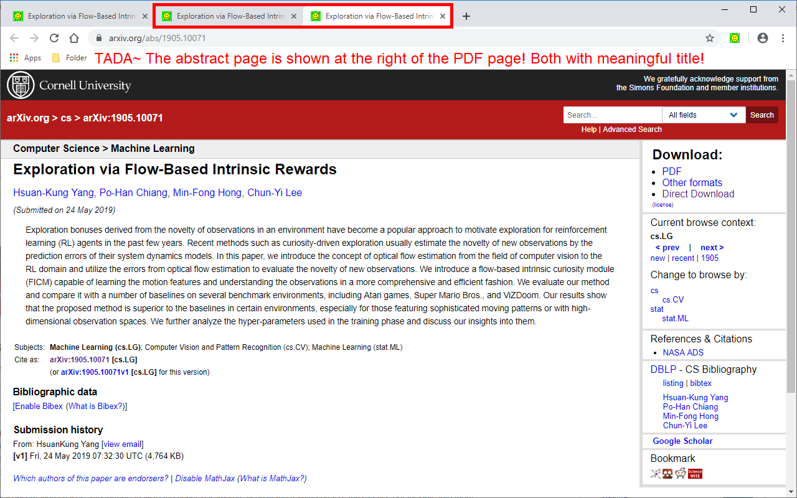
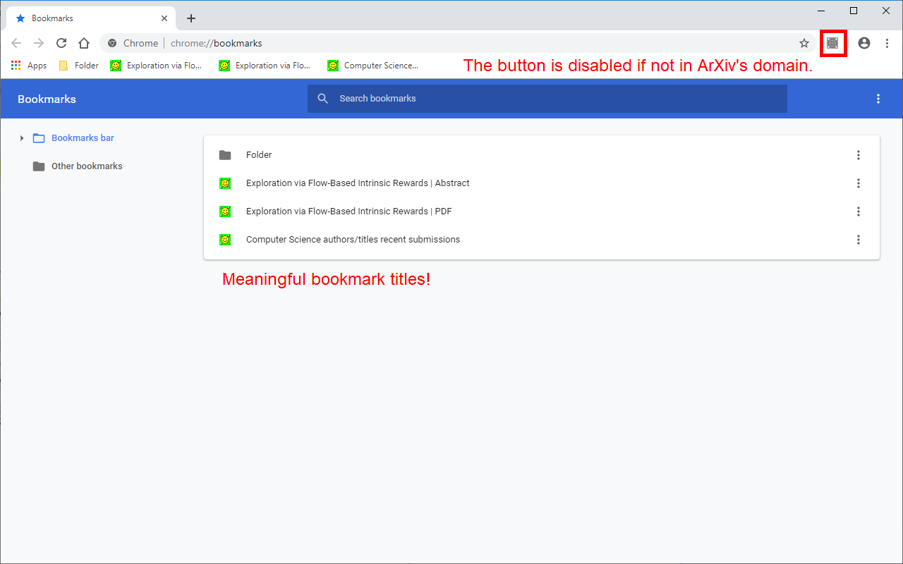
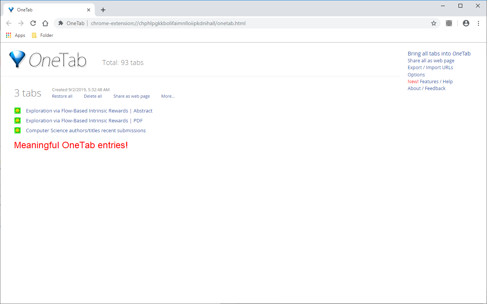
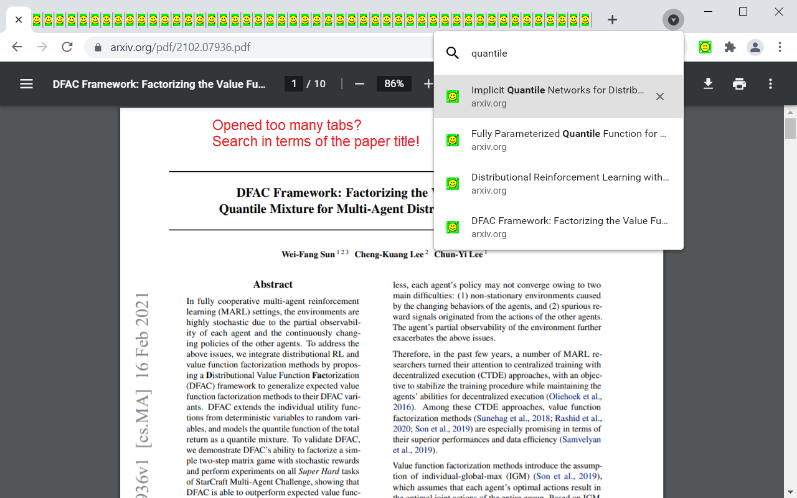
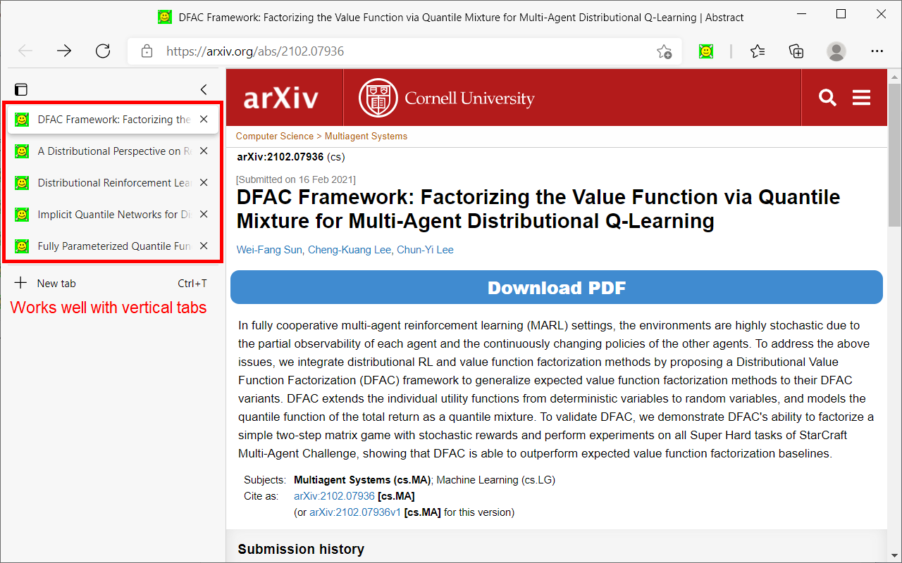
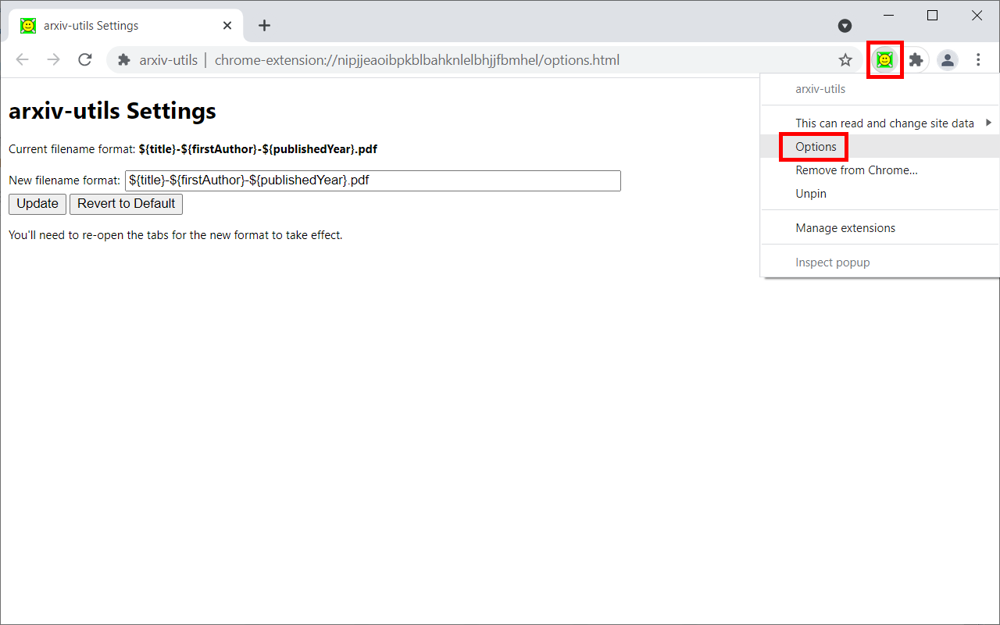

# arxiv-utils

If you are a researcher that reads a lot on ArXiv, you'll benefit a lot from this web extension.

- Renames the title of PDF page to the paper's title.
- Adds a button to navigate back to Abstract page.
- Download PDF with paper's title as filename.
- Open the paper in extra services such as [ar5iv](https://ar5iv.labs.arxiv.org/) and [arXiv Vanity](https://www.arxiv-vanity.com/).
- Works with Native Tab Search, and other plugins! (See the [Solution Descriptions](#solution-descriptions) section for more details)
- All required permissions are documented in detail.

Please [open an issue](https://github.com/j3soon/arxiv-utils/issues) if you have any questions, feature requests, or bug reports.

## Download Links

Supports Chrome, Firefox, Edge, Firefox on Android. (Not tested on Android)

- [Chrome Web Store](https://chrome.google.com/webstore/detail/arxiv-utils/mnhdpeipjhhkmlhlcljdjpgmilbmehij)
- [Firefox Add-on](https://addons.mozilla.org/en-US/firefox/addon/arxiv-utils/)
- [Edge Add-on](https://microsoftedge.microsoft.com/addons/detail/arxivutils/ngjpcfjabahdoadnajbhnikbemhmemdg)

Alternatively, these 3 browsers can also load arxiv-utils directly from source. First, download the source code release from [Releases](https://github.com/j3soon/arxiv-utils/releases), and then load the extension as an unpacked extension following the [Development Section](#development).

## Screenshots

The paper id in the title has been removed automatically!
A direct download link is added to download PDF with paper's title as the filename!

Finally... Meaningful paper title instead of paper id! (For Firefox, this is achieved through a custom PDF container.)

Difficult to get back to abstract page...
Click to get back to abstract page!

TADA~ The abstract page is shown at the right of the PDF page! Both with meaningful title!

The button is disabled if not in ArXiv's domain.
Meaningful bookmark titles.

Meaningful OneTab entries! (Chrome & Edge only)

Opened too many tabs? Search in terms of the paper title!

Works well with vertical tabs.

Right-click the extension icon and select `Options` to set your preference. (Chrome & Edge)

Go to add-ons page, click the extension select `Options` to set your preference. (Firefox)

## Solution Descriptions

For ArXiv PDF / abstract tabs:

- Renames the title to paper's title automatically in the background. (Originally is meaningless paper id, or start with paper id)
- Add a browser button to open its corresponding abstract / PDF page. (Originally is hard to get back to abstract page from PDF page)
- Add a direct download link on abstract page, click it to download the PDF with the title as filename. (Originally is paper id as filename)
- Open the paper in extra services such as [ar5iv](https://ar5iv.labs.arxiv.org/) and [arXiv Vanity](https://www.arxiv-vanity.com/).
- Better title even for bookmarks and the [OneTab](https://www.one-tab.com/) plugin!
- Firefox has [strict restrictions on PDF.js](https://bugzilla.mozilla.org/show_bug.cgi?id=1454760). So it doesn't work well with OneTab, the PDF renaming is achieved by intercepting requests and show the PDF in a container. The bookmark works well though.
- Works well with native tab search (credits: [@The Rooler](https://addons.mozilla.org/en-US/firefox/addon/arxiv-utils/reviews/1674567/))
  - [Tab search on Firefox](https://support.mozilla.org/en-US/kb/search-open-tabs-firefox)
  - [Enable Tab search on Chrome](https://www.howtogeek.com/722640/how-to-enable-or-disable-the-tab-search-icon-in-chrome/), [Tab search on Chrome](https://www.howtogeek.com/704212/how-to-search-open-tabs-on-google-chrome/)
  - [Enable Tab search on Edge](https://www.makeuseof.com/microsoft-edge-chrome-tab-search/)

## Privacy Policy

We do not gather your personal data. If in doubt, please refer to the source code.

### Chrome / Edge Permissions

- `tabs`: On extension button click, open a new tab and move it to the right of the old active tab.
- `activeTab`: Read active tab's title and modify it using the tab's url.
- `storage`: Save extension configurations.
- `contextMenus`: When right-click the extension button, show a help menu item.
- `scripting`: Inject content scripts to existing tabs.
- `*://export.arxiv.org/*`: Inject content scripts to existing tabs.
- `*://arxiv.org/*`: Inject content scripts to existing tabs.

### Firefox Permissions

- `tabs`: On extension button click, open a new tab and move it to the right of the old active tab.
- `activeTab`: Read active tab's title and modify it using the tab's url.
- `storage`: Save extension configurations.
- `contextMenus`: When right-click the extension button, show a help menu item.
- `webRequest`: Intercept ArXiv PDF request.
- `webRequestBlocking`: Redirect the ArXiv PDF page to custom PDF container page.
- `bookmarks`: When create a new bookmark of the PDF container page, bookmark the actual ArXiv PDF url instead.
- `*://export.arxiv.org/*pdf*`: Redirect PDF pages to custom PDF container.
- `*://arxiv.org/*pdf*`: Redirect PDF pages to custom PDF container.
- `"content_security_policy": "script-src 'self'; object-src 'self' https://arxiv.org https://export.arxiv.org;"`: For embedding PDF in container.
- `"web_accessible_resources": [ "pdfviewer.html" ]`: To redirect from HTTPS to extension custom page requires them to be visible.

## Developer Notes

### Development

- Chrome: [Debugging extensions](https://developer.chrome.com/docs/extensions/mv3/tut_debugging/)
- Firefox: [Test and debug](https://extensionworkshop.com/documentation/develop/#test-and-debug)
- Edge: [Sideload an extension](https://learn.microsoft.com/en-us/microsoft-edge/extensions-chromium/getting-started/extension-sideloading)

For viewing the content script logs, open the Inspector of the arXiv webpage (as in normal web development).

For viewing background script logs, open the Inspector of the plugin in the `Extensions` page.
- Firefox: Go to `about:debugging#/runtime/this-firefox` and click `Inspect` on the temporarily loaded extension.
- Chrome: Go to `chrome://extensions/` and click `Inspect views: background page` on the loaded (unpacked) extension.
- Edge: Go to `edge://extensions/` and click `Inspect views: service workder` on the loaded (unpacked) extension.

## Tests

The automated tests currently include the following:

- **Default tests**: Test the default title name of arXiv abstract/PDF pages.
- **Navigation tests**: Test the arxiv-utils button can switch between arXiv abstract/PDF pages, and the title is modified.

The testcases along with their description is stored in [tests/testcases.yaml](tests/testcases.yaml).

Other functions should still be tested manually:

- **Bookmark tests**: Test the bookmarked URL.
  - Try to bookmark an abstract tab, the title should be the new title.
  - Try to bookmark a PDF tab, the title should be the new title.
  - (Firefox Only) Check the PDF bookmark's URL, it should be the original ArXiv PDF link.
- **Download tests**: Test the downloaded file name.
  - Test PDF download (`Download PDF (arxiv-utils)`) in abstract. In firefox, only mouse left-click works, middle-click open up the original PDF page in a new tab.
  - Change filename format options, reload page, and download to verify the filename is changed.
  - Reset filename format option to default, reload page, and download to verify the filename format is default.
  - Test papers with long title.
  - Test papers with special characters in title.
- The extension button should be disabled outside ArXiv's domain.
- (Chrome Only) If [OneTab](https://www.one-tab.com/) is installed, click its extension button, the list should show the updated titles of both abstract and PDF page.
- (Chrome Only) Clear the browser cache and reload the PDF page, the title should be the new title after PDF load.  
  Test with: https://arxiv.org/abs/1512.03385
- Verify there are no console errors in both the content script and background script logs.
- Disable and re-enabling the extension should not cause any errors.
- Installing or re-enabling the extension should immediately update the title of existing tabs.
- The help menu item in the context menu should link to this GitHub page.

### Build and Publish

- Chrome: [Chrome Web Store Developer Dashboard](https://chrome.google.com/webstore/devconsole)
- Firefox: [Add-on Developer Hub](https://addons.mozilla.org/en-US/developers/addons)
- Edge: [Microsoft Partner Center](https://partner.microsoft.com/en-us/dashboard/microsoftedge)

## Frequently Asked Questions (FAQ)

- Q: Selenium (or WebDriver) has no API to click addon/extension buttons, how do the automated tests click the arxiv-utils button?

  A: This can be achieved by any tool that can simulate mouse click. Since we use Selenium Grid, for simplicity, we apply a hacky workaround that use one meta browser to click the arxiv-utils button in another browser through VNC web viewer. I'm not sure if [other testing tools](https://learn.microsoft.com/en-us/microsoft-edge/test-and-automation/test-and-automation) can achieve this more easily.

If you have further questions, please [open an issue](https://github.com/j3soon/arxiv-utils/issues).

## Related Extensions

- [musically-ut/arXiv-title-fixer](https://github.com/musically-ut/arXiv-title-fixer) that works well on Google Chrome.
  This requires a button click to change the pdf title, but will be considered less intrusive than running in the background.
- [weakish/arxiv-url](https://github.com/weakish/arxiv-url)
  This claims to add a back button, but I can't get it working.
- [imurray/redirectify](https://github.com/imurray/redirectify)
  Automatically redirect PDF links to HTML index page for many academic paper sites.
